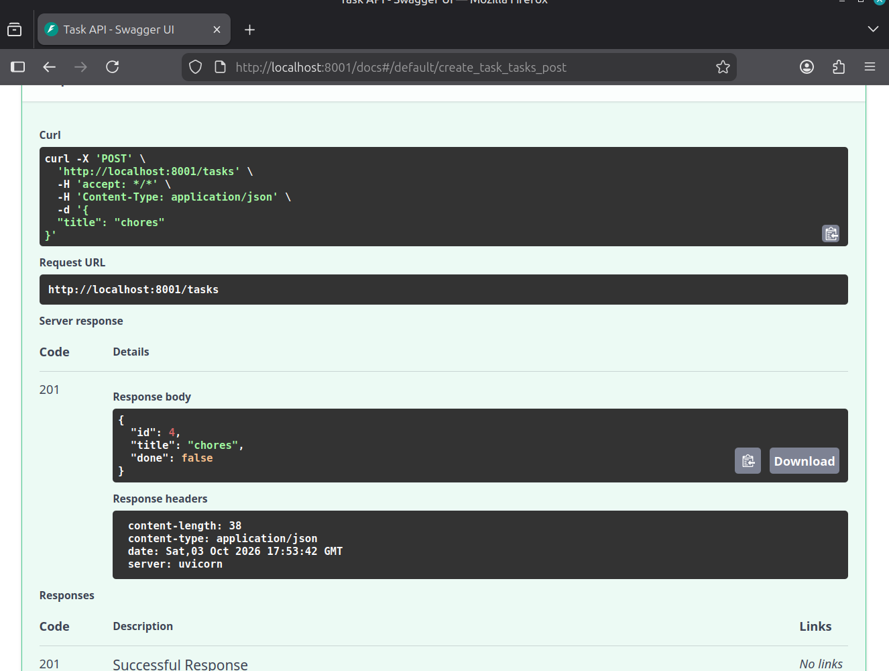
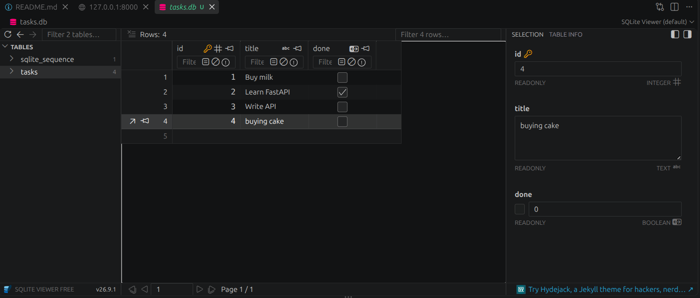
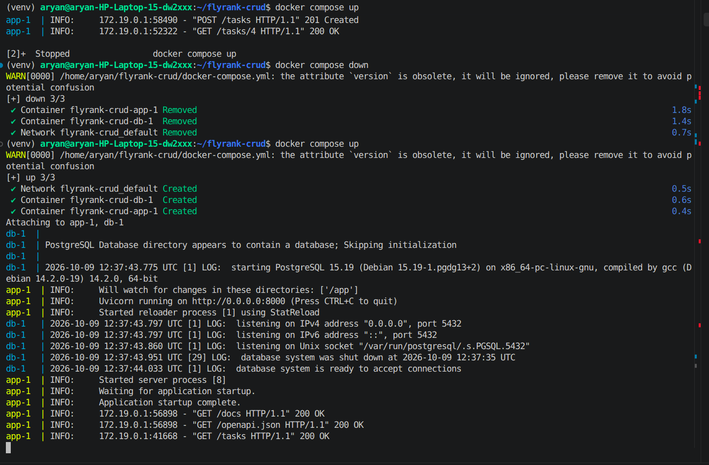

# FlyRank CRUD API — PostgreSQL + Docker

A simple CRUD API built with **Python + FastAPI**, backed by **PostgreSQL** running in **Docker**.

The API endpoints are identical to the original SQLite version. Only the storage layer changed — this is the architecture proving itself.

---

## How to Run (one command)

```bash
docker compose up
```

The server starts at `http://localhost:8000`.
The Swagger UI is at `http://localhost:8000/docs`.

> The database and table are created automatically on the first run.

---

## Endpoints

| CRUD operation | HTTP method | Endpoint | Meaning |
|---|---|---|---|
| Read (Meta) | GET | `/` | API Root |
| Read (Meta) | GET | `/health` | Health Check |
| Read | GET | `/tasks` | List all tasks |
| Read | GET | `/tasks/{id}` | Get a specific task by ID |
| Create | POST | `/tasks` | Add a new task |
| Update | PUT | `/tasks/{id}` | Update an existing task |
| Delete | DELETE | `/tasks/{id}` | Remove a task |

---

## Environment Variables

The database connection string is stored in `.env` (gitignored). A safe example is committed as `.env.example`:

```env
DATABASE_URL=postgresql://postgres:postgres@db:5432/tasksdb
```

Copy it to get started:
```bash
cp .env.example .env
```

---

## Architecture

```
Client → FastAPI (app container) → PostgreSQL (db container)
```

The service and routes are **completely unchanged** from the SQLite version. Only `get_db_connection()` and the SQL queries were updated to use `psycopg2` and Postgres syntax (`%s` placeholders, `SERIAL`, `RETURNING`).

---

## Proving Persistence

To verify data survives a full restart:

```bash
# 1. Start the stack
docker compose up

# 2. Create a task
curl -X POST http://localhost:8000/tasks -H "Content-Type: application/json" -d '{"title":"Survives restart"}'

# 3. Stop everything (Ctrl+C), then restart
docker compose down
docker compose up

# 4. Check the task is still there
curl http://localhost:8000/tasks
```

The task will still exist because Postgres data is stored in a named Docker volume (`postgres_data`), not inside the container.

---

## Example curl Request

```bash
curl -i http://localhost:8000/tasks/1
```

Output:
```http
HTTP/1.1 200 OK
content-type: application/json

{"id":1,"title":"Buy milk","done":false}
```

---

## Swagger UI



---

## Database Viewer



## containerizing
