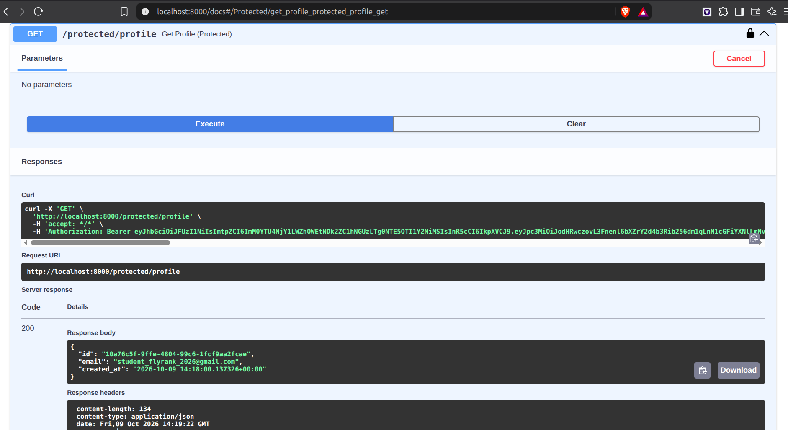

# FlyRank Secure Auth API — Supabase + FastAPI + JWT

A secure authentication API built with **Python + FastAPI** and **Supabase Auth**, using **JWT Bearer Tokens** to protect routes.

---

## What this Project is

In previous assignments, the API was unprotected. This project secures the API by integrating **Supabase as the Identity Provider (IdP)**. It implements user registration (Sign Up), authentication (Log In), session termination (Log Out), public endpoints, and protected endpoints guarded by JWT verification via reusable FastAPI dependencies.

---

## Setup & How to Run

### 1. Configure Environment Variables
Copy `.env.example` to `.env`:
```bash
cp .env.example .env
```
Open `.env` and fill in your Supabase credentials:
```env
SUPABASE_URL=your_supabase_project_url
SUPABASE_KEY=your_supabase_anon_key
```

### 2. Install Dependencies
```bash
source venv/bin/activate
pip install -r requirements.txt
```

### 3. Start the Server (Single Terminal Command)
```bash
python run_auth.py
```
- Server starts on `http://localhost:8000`
- Interactive Swagger UI documentation is available at `http://localhost:8000/docs`

---

## API Reference

| HTTP Method | Endpoint | Requires Auth? | Description |
|---|---|---|---|
| GET | `/public/info` | ❌ No | Public welcome message |
| POST | `/auth/signup` | ❌ No | Register a new user account |
| POST | `/auth/login` | ❌ No | Authenticate user & return JWT access token |
| POST | `/auth/logout` | ✅ Bearer Token | Terminate session |
| GET | `/protected/profile` | ✅ Bearer Token | View authenticated user profile data |
| GET | `/protected/dashboard` | ✅ Bearer Token | View private user dashboard |

---

## HTTP Status Codes

| Code | Name | Description |
|---|---|---|
| `200` | OK | Successful login, profile read, or dashboard access |
| `201` | Created | Successfully registered a new user |
| `204` | No Content | Successfully logged out |
| `400` | Bad Request | Missing email or password |
| `401` | Unauthorized | Missing, invalid, or expired Bearer token |

---

## Testing the API

### 1. Sign Up (Create account)
```bash
curl -i -X POST http://localhost:8000/auth/signup \
  -H "Content-Type: application/json" \
  -d '{"email":"student@example.com","password":"password123"}'
```

### 2. Log In (Get your JWT access token)
```bash
curl -i -X POST http://localhost:8000/auth/login \
  -H "Content-Type: application/json" \
  -d '{"email":"student@example.com","password":"password123"}'
```
*Copy the `access_token` from the JSON response.*

### 3. Access Protected Route with Token
```bash
curl -i http://localhost:8000/protected/profile \
  -H "Authorization: Bearer <PASTE_YOUR_ACCESS_TOKEN_HERE>"
```

### 4. Test Token Rejection (Without Token or Invalid Token)
```bash
curl -i http://localhost:8000/protected/profile
```
*Returns `401 Unauthorized` with `{"detail":{"error":"Invalid or expired token"}}`.*

---

## Swagger UI & Bearer Auth

FastAPI automatically generates interactive Swagger documentation at `http://localhost:8000/docs`.
- Protected routes display a 🔒 **lock icon**.
- Click the green **Authorize** button at the top right, paste your `access_token`, and click **Authorize**.
- You can now test `/protected/profile` and `/protected/dashboard` directly in your browser.



---

## Security Best Practices Followed
- **No secrets in version control**: `.env` is listed in `.gitignore`. Only `.env.example` with placeholders is committed.
- **Delegated Cryptography**: Authentication and password management are handled by Supabase Auth (IdP), avoiding custom unsafe password hashing.
- **Reusable Security Dependency**: Route protection is abstracted into FastAPI's `get_current_user` dependency utilizing `HTTPBearer`.
